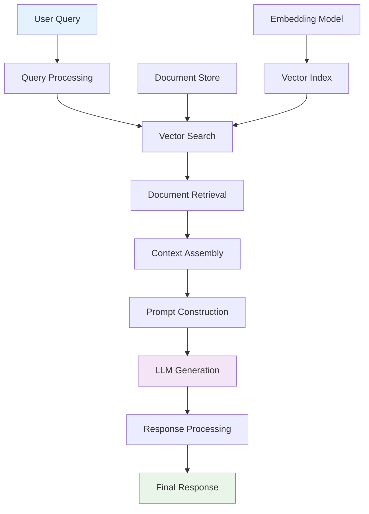

# AI Log Auditing Platform - LLM Techniques Documentation

## Table of Contents
1. [LLM Techniques Overview](#llm-techniques-overview)
2. [RAG (Retrieval-Augmented Generation) Implementation](#rag-retrieval-augmented-generation-implementation)
3. [Prompt Engineering Strategies](#prompt-engineering-strategies)
4. [LLM Integration Patterns](#llm-integration-patterns)
5. [Context Management](#context-management)
6. [Response Generation Techniques](#response-generation-techniques)
7. [Error Handling & Fallback Strategies](#error-handling--fallback-strategies)
8. [Performance Optimization](#performance-optimization)
9. [Security & Safety Measures](#security--safety-measures)
10. [Fine-tuning and Adaptation](#fine-tuning-and-adaptation)
11. [Evaluation Metrics](#evaluation-metrics)
12. [Best Practices](#best-practices)

---

## LLM Techniques Overview

The AI Log Auditing Platform leverages several advanced Large Language Model (LLM) techniques to provide intelligent log analysis, insights generation, and natural language interactions. These techniques are carefully integrated to ensure accurate, context-aware, and efficient processing of log data.

### Core LLM Techniques Used
- **Retrieval-Augmented Generation (RAG)**: Context-aware response generation
- **Prompt Engineering**: Structured query formulation
- **Context Window Management**: Efficient context utilization
- **Temperature Control**: Response consistency and creativity
- **Fallback Strategies**: Graceful degradation when LLM unavailable
- **Hybrid Approach**: Combining LLM with rule-based systems

### LLM Integration Architecture
```
User Query -> Context Retrieval -> Prompt Engineering -> LLM Processing -> Response Generation -> Post-processing
```

---

## RAG (Retrieval-Augmented Generation) Implementation

### RAG Architecture Overview



### RAG Implementation Details

#### Vector Store Configuration
```python
class RagRetriever:
    def __init__(self, db_path: Path = PAST_LOG_DB) -> None:
        self.db_path = db_path
        self.docs: List[Dict] = []
        self.vectorizer = TfidfVectorizer(max_features=4000)
        self.index = None
        self.doc_vectors = None
        self._load()
    
    def _build_index(self) -> None:
        """Build FAISS index for efficient similarity search"""
        if not self.docs:
            self.index = None
            self.doc_vectors = None
            return
        
        # Extract text from documents
        texts = [d.get("message", "") for d in self.docs]
        
        # Create TF-IDF vectors
        tfidf = self.vectorizer.fit_transform(texts).toarray().astype("float32")
        self.doc_vectors = tfidf
        
        # Build FAISS index for efficient search
        self.index = faiss.IndexFlatL2(tfidf.shape[1])
        self.index.add(tfidf)
```

#### Document Retrieval Process
```python
def query(self, query_text: str, k: int = 5) -> List[Dict]:
    """Retrieve relevant documents for query"""
    if not self.index or not self.docs:
        return []
    
    # Transform query to vector space
    query_vec = self.vectorizer.transform([query_text]).toarray().astype("float32")
    
    # Search for similar documents
    distances, indices = self.index.search(query_vec, min(k, len(self.docs)))
    
    # Format results with distance scores
    results = []
    for idx, dist in zip(indices[0], distances[0]):
        if idx < 0:
            continue
        doc = dict(self.docs[idx])
        doc["distance"] = float(dist)
        results.append(doc)
    
    return results
```

#### Context Assembly Strategy
```python
def assemble_context(self, query: str, timeline: List[Dict], k: int = 5) -> str:
    """Assemble context from multiple sources"""
    context_parts = []
    
    # 1. Recent high-priority logs
    high_priority_logs = [
        log for log in timeline 
        if log.get("severity") in {"ERROR", "CRITICAL"}
    ][:20]
    
    if high_priority_logs:
        context_parts.append("Recent Critical Events:")
        context_parts.extend([f"- {log['message']}" for log in high_priority_logs])
    
    # 2. RAG-retrieved similar logs
    rag_context = self.query(query, k=k)
    if rag_context:
        context_parts.append("\nSimilar Historical Events:")
        for doc in rag_context:
            context_parts.append(f"- {doc.get('message', 'N/A')} (similarity: {doc.get('distance', 0):.2f})")
    
    # 3. System state information
    if timeline:
        context_parts.append(f"\nSystem State: {len(timeline)} total logs analyzed")
    
    return "\n".join(context_parts)
```

### RAG Optimization Techniques

#### 1. Hybrid Retrieval Strategy
```python
def hybrid_query(self, query: str, k: int = 5) -> List[Dict]:
    """Combine semantic and keyword search"""
    # Semantic search
    semantic_results = self.query(query, k=k)
    
    # Keyword-based search
    keyword_results = self.keyword_search(query, k=k)
    
    # Merge and deduplicate
    all_results = semantic_results + keyword_results
    seen = set()
    unique_results = []
    
    for result in all_results:
        doc_id = result.get('id', result.get('message', ''))
        if doc_id not in seen:
            seen.add(doc_id)
            unique_results.append(result)
    
    return unique_results[:k]

def keyword_search(self, query: str, k: int = 5) -> List[Dict]:
    """Fallback keyword-based search"""
    query_terms = query.lower().split()
    scored_docs = []
    
    for doc in self.docs:
        score = 0
        message = doc.get('message', '').lower()
        
        for term in query_terms:
            if term in message:
                score += 1
        
        if score > 0:
            scored_docs.append({**doc, 'distance': 1.0 / (score + 1)})
    
    # Sort by score and return top k
    scored_docs.sort(key=lambda x: x['distance'])
    return scored_docs[:k]
```

#### 2. Dynamic Context Window Management
```python
def optimize_context_length(self, context: str, max_tokens: int = 4000) -> str:
    """Optimize context to fit within token limits"""
    # Rough token estimation (1 token ~ 4 characters)
    estimated_tokens = len(context) // 4
    
    if estimated_tokens <= max_tokens:
        return context
    
    # Truncate context while preserving important parts
    lines = context.split('\n')
    truncated_lines = []
    current_length = 0
    
    for line in lines:
        line_tokens = len(line) // 4
        if current_length + line_tokens > max_tokens:
            break
        truncated_lines.append(line)
        current_length += line_tokens
    
    return '\n'.join(truncated_lines)
```

---

## Prompt Engineering Strategies

### Prompt Design Principles

#### 1. Role-Based Prompting
```python
def create_system_prompt(self, role: str, context: str) -> str:
    """Create role-specific system prompts"""
    prompts = {
        'incident_investigator': (
            "You are a senior production incident investigator with 10+ years of experience. "
            "You specialize in log analysis, root cause identification, and incident resolution. "
            "Provide clear, actionable insights based on the provided log data."
        ),
        'system_analyst': (
            "You are a system performance analyst focused on identifying patterns, "
            "anomalies, and optimization opportunities in log data. "
            "Provide detailed technical analysis with specific recommendations."
        ),
        'security_analyst': (
            "You are a cybersecurity expert specializing in log analysis for threat detection. "
            "Focus on security events, potential breaches, and vulnerability indicators."
        )
    }
    
    base_prompt = prompts.get(role, prompts['incident_investigator'])
    return f"{base_prompt}\n\nContext: {context}"
```

#### 2. Structured Output Prompts
```python
def create_structured_prompt(self, task: str, data: Dict) -> str:
    """Create prompts for structured JSON output"""
    prompt_templates = {
        'root_cause_analysis': (
            "Analyze the following log data and provide a JSON response with these exact keys:\n"
            "- root_cause: Primary cause of issues (string)\n"
            "- failing_component: Component experiencing issues (string)\n"
            "- chain_of_events: Sequence of events leading to issues (array of strings)\n"
            "- fix_recommendations: Specific actionable fixes (array of strings)\n"
            "- severity: Current severity level (string: low/medium/high/critical)\n"
            "- estimated_impact: Business impact assessment (string)\n\n"
            "Log Data: {data}\n\n"
            "Provide only valid JSON response:"
        ),
        'error_classification': (
            "Classify each log entry and provide JSON with:\n"
            "- classifications: Array of objects with id, category, confidence\n"
            "- patterns: Common error patterns identified\n"
            "- recommendations: Suggested actions\n\n"
            "Logs: {data}\n\n"
            "Valid JSON only:"
        )
    }
    
    template = prompt_templates.get(task, prompt_templates['root_cause_analysis'])
    return template.format(data=json.dumps(data, indent=2))
```

#### 3. Few-Shot Learning Prompts
```python
def create_few_shot_prompt(self, examples: List[Dict], query: str) -> str:
    """Create prompt with examples for few-shot learning"""
    prompt_parts = [
        "Analyze the following log patterns and provide insights based on these examples:"
    ]
    
    # Add examples
    for i, example in enumerate(examples, 1):
        prompt_parts.append(f"\nExample {i}:")
        prompt_parts.append(f"Log: {example['log']}")
        prompt_parts.append(f"Analysis: {example['analysis']}")
    
    # Add current query
    prompt_parts.extend([
        f"\nCurrent Log: {query}",
        "Analysis:"
    ])
    
    return '\n'.join(prompt_parts)
```

### Advanced Prompt Techniques

#### 1. Chain-of-Thought Prompting
```python
def create_cot_prompt(self, problem: str, context: str) -> str:
    """Create chain-of-thought prompt for complex reasoning"""
    return f"""
Analyze this step-by-step and show your reasoning:

Problem: {problem}

Context: {context}

Think step by step:
1. First, identify the key issues in the log data
2. Then, analyze the patterns and relationships
3. Next, determine the root causes
4. Finally, provide specific recommendations

Provide your analysis with detailed reasoning for each step.
"""
```

#### 2. Self-Consistency Prompts
```python
def create_self_consistency_prompt(self, query: str, num_samples: int = 3) -> str:
    """Create prompt for self-consistency checking"""
    return f"""
Analyze this log data and provide your answer. Then, reconsider and provide 2 alternative analyses:

Query: {query}

Provide 3 different analyses:
Analysis 1:
Analysis 2:
Analysis 3:

After providing all 3, identify the most consistent conclusion.
"""
```

#### 3. Decomposition Prompts
```python
def create_decomposition_prompt(self, complex_query: str) -> str:
    """Break down complex queries into simpler sub-tasks"""
    return f"""
Break this complex analysis into smaller steps:

Complex Query: {complex_query}

Step 1: Identify the main issues
Step 2: Analyze each issue separately
Step 3: Synthesize findings
Step 4: Provide integrated recommendations

Address each step systematically:
"""
```

---

## LLM Integration Patterns

### 1. Synchronous Integration Pattern
```python
class LLMProcessor:
    def __init__(self, grok_client: GrokClient, rag_retriever: RagRetriever):
        self.grok = grok_client
        self.rag = rag_retriever
    
    def process_query(self, query: str, context: Dict) -> Dict:
        """Synchronous LLM processing"""
        try:
            # Step 1: Retrieve relevant context
            rag_context = self.rag.query(query, k=5)
            
            # Step 2: Construct prompt
            prompt = self.construct_prompt(query, context, rag_context)
            
            # Step 3: Generate response
            response = self.grok.generate(prompt, temperature=0.2)
            
            # Step 4: Process response
            processed_response = self.process_response(response)
            
            return {
                'status': 'success',
                'response': processed_response,
                'context_used': len(rag_context),
                'confidence': self.calculate_confidence(response)
            }
            
        except Exception as e:
            return {
                'status': 'error',
                'error': str(e),
                'fallback': self.generate_fallback_response(query, context)
            }
```

### 2. Asynchronous Integration Pattern
```python
import asyncio
from concurrent.futures import ThreadPoolExecutor

class AsyncLLMProcessor:
    def __init__(self, grok_client: GrokClient, rag_retriever: RagRetriever):
        self.grok = grok_client
        self.rag = rag_retriever
        self.executor = ThreadPoolExecutor(max_workers=4)
    
    async def process_query_async(self, query: str, context: Dict) -> Dict:
        """Asynchronous LLM processing"""
        try:
            # Run context retrieval in thread pool
            rag_context = await asyncio.get_event_loop().run_in_executor(
                self.executor, self.rag.query, query, 5
            )
            
            # Run LLM generation in thread pool
            prompt = self.construct_prompt(query, context, rag_context)
            response = await asyncio.get_event_loop().run_in_executor(
                self.executor, self.grok.generate, prompt, 0.2
            )
            
            return {
                'status': 'success',
                'response': response,
                'async_processing': True
            }
            
        except Exception as e:
            return {
                'status': 'error',
                'error': str(e),
                'fallback': self.generate_fallback_response(query, context)
            }
```

### 3. Batch Processing Pattern
```python
class BatchLLMProcessor:
    def __init__(self, grok_client: GrokClient, rag_retriever: RagRetriever):
        self.grok = grok_client
        self.rag = rag_retriever
    
    def process_batch(self, queries: List[str], context: Dict) -> List[Dict]:
        """Process multiple queries in batch"""
        results = []
        
        # Step 1: Batch context retrieval
        all_contexts = []
        for query in queries:
            context_docs = self.rag.query(query, k=3)
            all_contexts.append(context_docs)
        
        # Step 2: Batch prompt construction
        prompts = []
        for i, query in enumerate(queries):
            prompt = self.construct_prompt(query, context, all_contexts[i])
            prompts.append(prompt)
        
        # Step 3: Batch LLM processing
        for i, prompt in enumerate(prompts):
            try:
                response = self.grok.generate(prompt, temperature=0.2)
                results.append({
                    'query': queries[i],
                    'response': response,
                    'status': 'success'
                })
            except Exception as e:
                results.append({
                    'query': queries[i],
                    'error': str(e),
                    'status': 'error',
                    'fallback': self.generate_fallback_response(queries[i], context)
                })
        
        return results
```

---

## Context Management

### 1. Context Window Optimization
```python
class ContextManager:
    def __init__(self, max_tokens: int = 4000):
        self.max_tokens = max_tokens
        self.reserved_tokens = 500  # Reserve for response
    
    def optimize_context(self, query: str, documents: List[Dict]) -> Dict:
        """Optimize context to fit within token limits"""
        # Calculate available tokens for context
        available_tokens = self.max_tokens - self.reserved_tokens - len(query) // 4
        
        # Prioritize documents by relevance and recency
        prioritized_docs = self.prioritize_documents(documents)
        
        # Select documents within token limit
        selected_docs = []
        current_tokens = 0
        
        for doc in prioritized_docs:
            doc_tokens = len(str(doc)) // 4
            if current_tokens + doc_tokens <= available_tokens:
                selected_docs.append(doc)
                current_tokens += doc_tokens
            else:
                break
        
        return {
            'selected_documents': selected_docs,
            'token_usage': current_tokens,
            'documents_excluded': len(documents) - len(selected_docs)
        }
    
    def prioritize_documents(self, documents: List[Dict]) -> List[Dict]:
        """Prioritize documents by relevance and recency"""
        # Sort by distance (relevance) and timestamp
        return sorted(
            documents,
            key=lambda x: (
                x.get('distance', float('inf')),
                -x.get('timestamp', 0)
            )
        )
```

### 2. Dynamic Context Adaptation
```python
class DynamicContextManager:
    def __init__(self):
        self.context_cache = {}
        self.usage_patterns = {}
    
    def adapt_context(self, query: str, base_context: List[Dict]) -> List[Dict]:
        """Adapt context based on query patterns"""
        # Analyze query type
        query_type = self.classify_query(query)
        
        # Adapt context based on query type
        if query_type == 'error_analysis':
            return self.adapt_for_error_analysis(base_context)
        elif query_type == 'performance':
            return self.adapt_for_performance(base_context)
        elif query_type == 'security':
            return self.adapt_for_security(base_context)
        else:
            return base_context
    
    def classify_query(self, query: str) -> str:
        """Classify query type for context adaptation"""
        query_lower = query.lower()
        
        if any(word in query_lower for word in ['error', 'failure', 'exception']):
            return 'error_analysis'
        elif any(word in query_lower for word in ['performance', 'slow', 'latency']):
            return 'performance'
        elif any(word in query_lower for word in ['security', 'attack', 'breach']):
            return 'security'
        else:
            return 'general'
    
    def adapt_for_error_analysis(self, context: List[Dict]) -> List[Dict]:
        """Adapt context for error analysis queries"""
        # Prioritize error logs
        error_docs = [doc for doc in context if 'error' in doc.get('message', '').lower()]
        other_docs = [doc for doc in context if doc not in error_docs]
        
        return error_docs[:10] + other_docs[:5]
    
    def adapt_for_performance(self, context: List[Dict]) -> List[Dict]:
        """Adapt context for performance queries"""
        # Prioritize performance-related logs
        perf_keywords = ['slow', 'timeout', 'latency', 'performance']
        perf_docs = [
            doc for doc in context 
            if any(keyword in doc.get('message', '').lower() for keyword in perf_keywords)
        ]
        other_docs = [doc for doc in context if doc not in perf_docs]
        
        return perf_docs[:8] + other_docs[:7]
```

### 3. Context Caching Strategy
```python
class ContextCache:
    def __init__(self, max_size: int = 1000, ttl: int = 3600):
        self.cache = {}
        self.max_size = max_size
        self.ttl = ttl
    
    def get_context(self, query_hash: str) -> Optional[List[Dict]]:
        """Retrieve cached context"""
        if query_hash in self.cache:
            cached_item = self.cache[query_hash]
            
            # Check if cache is still valid
            if time.time() - cached_item['timestamp'] < self.ttl:
                return cached_item['context']
            else:
                del self.cache[query_hash]
        
        return None
    
    def cache_context(self, query_hash: str, context: List[Dict]) -> None:
        """Cache context for future use"""
        # Remove oldest item if cache is full
        if len(self.cache) >= self.max_size:
            oldest_key = min(self.cache.keys(), 
                           key=lambda k: self.cache[k]['timestamp'])
            del self.cache[oldest_key]
        
        self.cache[query_hash] = {
            'context': context,
            'timestamp': time.time()
        }
    
    def generate_query_hash(self, query: str, filters: Dict = None) -> str:
        """Generate hash for query caching"""
        import hashlib
        query_str = query + str(sorted(filters.items()) if filters else '')
        return hashlib.md5(query_str.encode()).hexdigest()
```

---

## Response Generation Techniques

### 1. Structured Response Generation
```python
class ResponseGenerator:
    def __init__(self, grok_client: GrokClient):
        self.grok = grok_client
        self.response_templates = self.load_templates()
    
    def generate_structured_response(self, query: str, context: Dict) -> Dict:
        """Generate structured JSON response"""
        prompt = self.create_structured_prompt(query, context)
        
        try:
            raw_response = self.grok.generate(prompt, temperature=0.1)
            
            # Parse and validate JSON response
            parsed_response = self.parse_json_response(raw_response)
            
            # Enhance with metadata
            enhanced_response = {
                **parsed_response,
                'metadata': {
                    'query': query,
                    'timestamp': datetime.now().isoformat(),
                    'confidence': self.calculate_confidence(parsed_response),
                    'sources_used': len(context.get('rag_context', []))
                }
            }
            
            return enhanced_response
            
        except Exception as e:
            return self.generate_fallback_response(query, context, str(e))
    
    def parse_json_response(self, response: str) -> Dict:
        """Parse and validate JSON response"""
        try:
            # Clean response to ensure valid JSON
            cleaned_response = self.clean_json_response(response)
            parsed = json.loads(cleaned_response)
            
            # Validate required fields
            required_fields = ['root_cause', 'failing_component', 'fix_recommendations']
            for field in required_fields:
                if field not in parsed:
                    parsed[field] = self.generate_default_field(field)
            
            return parsed
            
        except json.JSONDecodeError:
            # Try to extract JSON from response
            json_match = re.search(r'\{.*\}', response, re.DOTALL)
            if json_match:
                return json.loads(json_match.group())
            else:
                raise ValueError("No valid JSON found in response")
    
    def clean_json_response(self, response: str) -> str:
        """Clean response to ensure valid JSON"""
        # Remove common JSON issues
        cleaned = response.strip()
        
        # Remove markdown code blocks
        cleaned = re.sub(r'```json\s*', '', cleaned)
        cleaned = re.sub(r'```\s*', '', cleaned)
        
        # Fix common formatting issues
        cleaned = re.sub(r',\s*}', '}', cleaned)  # Remove trailing commas
        cleaned = re.sub(r',\s*]', ']', cleaned)  # Remove trailing commas in arrays
        
        return cleaned
```

### 2. Multi-Modal Response Generation
```python
class MultiModalGenerator:
    def __init__(self, grok_client: GrokClient):
        self.grok = grok_client
    
    def generate_multi_modal_response(self, query: str, context: Dict) -> Dict:
        """Generate response with multiple formats"""
        # Generate text response
        text_response = self.generate_text_response(query, context)
        
        # Generate summary
        summary = self.generate_summary(text_response)
        
        # Generate action items
        action_items = self.extract_action_items(text_response)
        
        # Generate confidence score
        confidence = self.calculate_response_confidence(text_response, context)
        
        return {
            'detailed_response': text_response,
            'summary': summary,
            'action_items': action_items,
            'confidence': confidence,
            'metadata': {
                'response_length': len(text_response),
                'generation_time': datetime.now().isoformat()
            }
        }
    
    def generate_summary(self, response: str) -> str:
        """Generate concise summary"""
        summary_prompt = f"""
        Summarize this analysis in 2-3 sentences:
        
        {response}
        
        Summary:
        """
        
        return self.grok.generate(summary_prompt, temperature=0.1) or response[:200]
    
    def extract_action_items(self, response: str) -> List[str]:
        """Extract actionable items from response"""
        action_prompt = f"""
        Extract specific, actionable items from this analysis:
        
        {response}
        
        Return as a numbered list of action items:
        """
        
        action_response = self.grok.generate(action_prompt, temperature=0.1)
        
        if action_response:
            # Parse numbered list
            actions = []
            for line in action_response.split('\n'):
                if line.strip() and (line[0].isdigit() or line.startswith('-')):
                    actions.append(line.strip())
            return actions
        
        return []
```

### 3. Adaptive Response Generation
```python
class AdaptiveResponseGenerator:
    def __init__(self, grok_client: GrokClient):
        self.grok = grok_client
        self.user_preferences = {}
    
    def generate_adaptive_response(self, query: str, context: Dict, user_id: str = None) -> Dict:
        """Generate response adapted to user preferences"""
        # Get user preferences
        preferences = self.user_preferences.get(user_id, self.get_default_preferences())
        
        # Adapt response based on preferences
        if preferences['detail_level'] == 'high':
            response = self.generate_detailed_response(query, context)
        elif preferences['detail_level'] == 'low':
            response = self.generate_concise_response(query, context)
        else:
            response = self.generate_standard_response(query, context)
        
        # Format based on preferences
        if preferences['format'] == 'markdown':
            response = self.format_as_markdown(response)
        elif preferences['format'] == 'json':
            response = self.format_as_json(response)
        
        return response
    
    def get_default_preferences(self) -> Dict:
        """Get default user preferences"""
        return {
            'detail_level': 'medium',
            'format': 'text',
            'technical_level': 'intermediate',
            'language': 'english'
        }
    
    def generate_detailed_response(self, query: str, context: Dict) -> str:
        """Generate detailed technical response"""
        prompt = f"""
        Provide a detailed technical analysis for this query:
        
        Query: {query}
        
        Context: {context}
        
        Include:
        1. Detailed root cause analysis
        2. Technical implementation details
        3. Step-by-step resolution process
        4. Long-term prevention strategies
        5. Related system considerations
        
        Provide comprehensive technical details:
        """
        
        return self.grok.generate(prompt, temperature=0.1)
    
    def generate_concise_response(self, query: str, context: Dict) -> str:
        """Generate concise response"""
        prompt = f"""
        Provide a brief, direct answer to this query:
        
        Query: {query}
        
        Context: {context}
        
        Keep it under 100 words and focus on the most important information.
        """
        
        return self.grok.generate(prompt, temperature=0.1)
```

---

## Error Handling & Fallback Strategies

### 1. Graceful Degradation
```python
class LLMFallbackHandler:
    def __init__(self):
        self.fallback_strategies = [
            self.rule_based_fallback,
            self.template_fallback,
            self.cached_response_fallback,
            self.minimal_response_fallback
        ]
    
    def handle_llm_failure(self, query: str, context: Dict, error: str) -> Dict:
        """Handle LLM failure with fallback strategies"""
        for strategy in self.fallback_strategies:
            try:
                response = strategy(query, context, error)
                if response:
                    return {
                        'status': 'fallback',
                        'response': response,
                        'fallback_strategy': strategy.__name__,
                        'original_error': error
                    }
            except Exception as fallback_error:
                continue
        
        # Last resort
        return {
            'status': 'error',
            'response': 'I apologize, but I\'m unable to process your request at this time. Please try again later.',
            'error': 'All fallback strategies failed'
        }
    
    def rule_based_fallback(self, query: str, context: Dict, error: str) -> str:
        """Rule-based fallback response"""
        query_lower = query.lower()
        
        if 'error' in query_lower or 'problem' in query_lower:
            return self.generate_error_analysis_fallback(context)
        elif 'risk' in query_lower or 'priority' in query_lower:
            return self.generate_risk_assessment_fallback(context)
        elif 'deploy' in query_lower or 'production' in query_lower:
            return self.generate_deployment_fallback(context)
        else:
            return self.generate_general_fallback(context)
    
    def template_fallback(self, query: str, context: Dict, error: str) -> str:
        """Template-based fallback response"""
        templates = {
            'error_analysis': "Based on the log analysis, I found {error_count} errors. The main issue appears to be related to {main_component}. Please review the logs for more details.",
            'risk_assessment': "Current system shows {risk_level} risk level with {error_count} errors detected. Priority should be given to addressing {main_issue}.",
            'deployment': "System readiness assessment shows {status} for deployment. {recommendation}",
            'general': "I've analyzed the available log data. The system shows {log_count} total entries with {error_count} errors. {general_recommendation}"
        }
        
        # Select appropriate template
        query_type = self.classify_query_for_template(query)
        template = templates.get(query_type, templates['general'])
        
        # Fill template with context data
        return template.format(**self.extract_template_data(context))
```

### 2. Circuit Breaker Pattern
```python
class CircuitBreaker:
    def __init__(self, failure_threshold: int = 5, timeout: int = 60):
        self.failure_threshold = failure_threshold
        self.timeout = timeout
        self.failure_count = 0
        self.last_failure_time = None
        self.state = 'CLOSED'  # CLOSED, OPEN, HALF_OPEN
    
    def call(self, func, *args, **kwargs):
        """Execute function with circuit breaker protection"""
        if self.state == 'OPEN':
            if time.time() - self.last_failure_time > self.timeout:
                self.state = 'HALF_OPEN'
            else:
                raise Exception("Circuit breaker is OPEN")
        
        try:
            result = func(*args, **kwargs)
            
            if self.state == 'HALF_OPEN':
                self.state = 'CLOSED'
                self.failure_count = 0
            
            return result
            
        except Exception as e:
            self.failure_count += 1
            self.last_failure_time = time.time()
            
            if self.failure_count >= self.failure_threshold:
                self.state = 'OPEN'
            
            raise e

class LLMCircuitBreaker:
    def __init__(self, grok_client: GrokClient):
        self.grok = grok_client
        self.circuit_breaker = CircuitBreaker()
    
    def safe_generate(self, prompt: str, temperature: float = 0.2) -> Optional[str]:
        """Generate with circuit breaker protection"""
        try:
            return self.circuit_breaker.call(
                self.grok.generate, prompt, temperature
            )
        except Exception as e:
            return None
```

### 3. Retry Mechanism
```python
class LLMRetryHandler:
    def __init__(self, max_retries: int = 3, backoff_factor: float = 2.0):
        self.max_retries = max_retries
        self.backoff_factor = backoff_factor
    
    def generate_with_retry(self, grok_client: GrokClient, prompt: str, 
                          temperature: float = 0.2) -> Optional[str]:
        """Generate with exponential backoff retry"""
        last_exception = None
        
        for attempt in range(self.max_retries + 1):
            try:
                response = grok_client.generate(prompt, temperature)
                if response:
                    return response
                    
            except Exception as e:
                last_exception = e
                
                if attempt < self.max_retries:
                    # Calculate backoff time
                    backoff_time = self.backoff_factor ** attempt
                    time.sleep(backoff_time)
                else:
                    break
        
        # All retries exhausted
        return None
```

---

## Performance Optimization

### 1. Response Caching
```python
class ResponseCache:
    def __init__(self, max_size: int = 1000, ttl: int = 1800):
        self.cache = {}
        self.max_size = max_size
        self.ttl = ttl
    
    def get_cached_response(self, query_hash: str) -> Optional[Dict]:
        """Get cached response if available and not expired"""
        if query_hash in self.cache:
            cached_item = self.cache[query_hash]
            
            if time.time() - cached_item['timestamp'] < self.ttl:
                return cached_item['response']
            else:
                del self.cache[query_hash]
        
        return None
    
    def cache_response(self, query_hash: str, response: Dict) -> None:
        """Cache response for future use"""
        if len(self.cache) >= self.max_size:
            # Remove oldest entry
            oldest_key = min(self.cache.keys(), 
                           key=lambda k: self.cache[k]['timestamp'])
            del self.cache[oldest_key]
        
        self.cache[query_hash] = {
            'response': response,
            'timestamp': time.time()
        }
    
    def generate_query_hash(self, query: str, context_hash: str) -> str:
        """Generate hash for query caching"""
        import hashlib
        combined = query + context_hash
        return hashlib.md5(combined.encode()).hexdigest()
```

### 2. Batch Processing Optimization
```python
class BatchProcessor:
    def __init__(self, batch_size: int = 5, timeout: float = 10.0):
        self.batch_size = batch_size
        self.timeout = timeout
        self.pending_requests = []
    
    def add_request(self, query: str, context: Dict, callback: callable):
        """Add request to batch"""
        self.pending_requests.append({
            'query': query,
            'context': context,
            'callback': callback,
            'timestamp': time.time()
        })
        
        # Process batch if full or timeout reached
        if (len(self.pending_requests) >= self.batch_size or 
            time.time() - self.pending_requests[0]['timestamp'] > self.timeout):
            self.process_batch()
    
    def process_batch(self):
        """Process batch of requests"""
        if not self.pending_requests:
            return
        
        batch = self.pending_requests.copy()
        self.pending_requests.clear()
        
        # Process batch
        try:
            responses = self.process_batch_llm(batch)
            
            for i, request in enumerate(batch):
                if i < len(responses):
                    request['callback'](responses[i])
                else:
                    request['callback'](None)
                    
        except Exception as e:
            # Handle batch failure
            for request in batch:
                request['callback'](None)
```

### 3. Context Preprocessing
```python
class ContextPreprocessor:
    def __init__(self):
        self.embedding_cache = {}
    
    def preprocess_context(self, context: List[Dict]) -> List[Dict]:
        """Preprocess context for optimal LLM performance"""
        # Remove duplicates
        unique_context = self.remove_duplicates(context)
        
        # Sort by relevance
        sorted_context = self.sort_by_relevance(unique_context)
        
        # Optimize content
        optimized_context = self.optimize_content(sorted_context)
        
        return optimized_context
    
    def remove_duplicates(self, context: List[Dict]) -> List[Dict]:
        """Remove duplicate documents"""
        seen = set()
        unique_context = []
        
        for doc in context:
            # Create content hash
            content = doc.get('message', '')
            content_hash = hashlib.md5(content.encode()).hexdigest()
            
            if content_hash not in seen:
                seen.add(content_hash)
                unique_context.append(doc)
        
        return unique_context
    
    def sort_by_relevance(self, context: List[Dict]) -> List[Dict]:
        """Sort context by relevance score"""
        return sorted(context, key=lambda x: x.get('distance', float('inf')))
    
    def optimize_content(self, context: List[Dict]) -> List[Dict]:
        """Optimize content for LLM processing"""
        optimized = []
        
        for doc in context:
            optimized_doc = doc.copy()
            
            # Truncate very long messages
            message = doc.get('message', '')
            if len(message) > 1000:
                optimized_doc['message'] = message[:1000] + '...'
            
            # Remove unnecessary fields
            unnecessary_fields = ['raw_line', 'parse_error']
            for field in unnecessary_fields:
                optimized_doc.pop(field, None)
            
            optimized.append(optimized_doc)
        
        return optimized
```

---

## Security & Safety Measures

### 1. Input Sanitization
```python
class LLMInputSanitizer:
    def __init__(self):
        self.malicious_patterns = [
            r'<script[^>]*>.*?</script>',
            r'javascript:',
            r'data:text/html',
            r'eval\s*\(',
            r'exec\s*\(',
            r'system\s*\('
        ]
    
    def sanitize_input(self, input_text: str) -> str:
        """Sanitize input for LLM processing"""
        if not isinstance(input_text, str):
            return ""
        
        # Remove malicious patterns
        sanitized = input_text
        
        for pattern in self.malicious_patterns:
            sanitized = re.sub(pattern, '', sanitized, flags=re.IGNORECASE)
        
        # Remove control characters
        sanitized = re.sub(r'[\x00-\x08\x0b\x0c\x0e-\x1f\x7f]', '', sanitized)
        
        # Limit length
        if len(sanitized) > 10000:
            sanitized = sanitized[:10000] + '...'
        
        return sanitized.strip()
    
    def validate_context(self, context: List[Dict]) -> List[Dict]:
        """Validate and sanitize context documents"""
        validated_context = []
        
        for doc in context:
            sanitized_doc = {}
            
            for key, value in doc.items():
                if isinstance(value, str):
                    sanitized_doc[key] = self.sanitize_input(value)
                else:
                    sanitized_doc[key] = value
            
            validated_context.append(sanitized_doc)
        
        return validated_context
```

### 2. Output Filtering
```python
class LLMOutputFilter:
    def __init__(self):
        self.forbidden_patterns = [
            r'password\s*[:=]\s*\S+',
            r'api_key\s*[:=]\s*\S+',
            r'token\s*[:=]\s*\S+',
            r'secret\s*[:=]\s*\S+',
            r'private_key\s*[:=]\s*\S+'
        ]
    
    def filter_output(self, output: str) -> str:
        """Filter LLM output for sensitive information"""
        if not isinstance(output, str):
            return ""
        
        filtered = output
        
        # Remove sensitive information patterns
        for pattern in self.forbidden_patterns:
            filtered = re.sub(pattern, '[REDACTED]', filtered, flags=re.IGNORECASE)
        
        # Remove potential code execution
        filtered = re.sub(r'```[^`]*```', '[CODE_BLOCK]', filtered)
        
        return filtered
    
    def validate_response(self, response: Dict) -> Dict:
        """Validate and filter response dictionary"""
        if not isinstance(response, dict):
            return {'error': 'Invalid response format'}
        
        validated_response = {}
        
        for key, value in response.items():
            if isinstance(value, str):
                validated_response[key] = self.filter_output(value)
            elif isinstance(value, list):
                validated_response[key] = [
                    self.filter_output(item) if isinstance(item, str) else item
                    for item in value
                ]
            else:
                validated_response[key] = value
        
        return validated_response
```

### 3. Access Control
```python
class LLMAccessControl:
    def __init__(self):
        self.rate_limits = {}
        self.access_logs = []
    
    def check_access(self, user_id: str, endpoint: str) -> bool:
        """Check if user has access to LLM endpoint"""
        # Check rate limiting
        if not self.check_rate_limit(user_id):
            return False
        
        # Log access attempt
        self.log_access(user_id, endpoint)
        
        return True
    
    def check_rate_limit(self, user_id: str) -> bool:
        """Check rate limiting for user"""
        current_time = time.time()
        user_limits = self.rate_limits.get(user_id, {'count': 0, 'reset_time': current_time})
        
        # Reset counter if time window passed
        if current_time - user_limits['reset_time'] > 3600:  # 1 hour window
            user_limits['count'] = 0
            user_limits['reset_time'] = current_time
        
        # Check if under limit
        if user_limits['count'] >= 100:  # 100 requests per hour
            return False
        
        # Increment counter
        user_limits['count'] += 1
        self.rate_limits[user_id] = user_limits
        
        return True
    
    def log_access(self, user_id: str, endpoint: str) -> None:
        """Log access for audit trail"""
        self.access_logs.append({
            'user_id': user_id,
            'endpoint': endpoint,
            'timestamp': time.time(),
            'ip_address': self.get_client_ip()
        })
        
        # Keep only recent logs
        if len(self.access_logs) > 10000:
            self.access_logs = self.access_logs[-5000:]
```

---

## Fine-tuning and Adaptation

### 1. Domain Adaptation
```python
class DomainAdapter:
    def __init__(self):
        self.domain_prompts = {
            'web_application': self.get_web_app_prompt(),
            'database_system': self.get_database_prompt(),
            'microservices': self.get_microservices_prompt(),
            'cloud_infrastructure': self.get_cloud_prompt()
        }
    
    def adapt_for_domain(self, query: str, context: Dict, domain: str) -> str:
        """Adapt prompt for specific domain"""
        base_prompt = self.domain_prompts.get(domain, self.get_general_prompt())
        
        domain_context = self.extract_domain_context(context, domain)
        
        adapted_prompt = f"""
        {base_prompt}
        
        Domain-specific context:
        {domain_context}
        
        User query: {query}
        
        Provide domain-specific analysis:
        """
        
        return adapted_prompt
    
    def get_web_app_prompt(self) -> str:
        """Get web application specific prompt"""
        return """
        You are an expert web application performance analyst. Focus on:
        - HTTP status codes and response times
        - Application errors and exceptions
        - User session and authentication issues
        - Database connection pooling
        - Cache performance
        - Load balancer health
        
        Analyze logs from web application perspective.
        """
    
    def get_database_prompt(self) -> str:
        """Get database specific prompt"""
        return """
        You are a database performance expert. Focus on:
        - Query performance and execution plans
        - Connection pool utilization
        - Index effectiveness
        - Lock contention and deadlocks
        - Replication lag
        - Backup and recovery issues
        
        Analyze logs from database administration perspective.
        """
```

### 2. Continuous Learning
```python
class ContinuousLearner:
    def __init__(self):
        self.feedback_data = []
        self.performance_metrics = {}
    
    def collect_feedback(self, query: str, response: str, 
                        user_feedback: Dict, context: Dict) -> None:
        """Collect user feedback for continuous improvement"""
        feedback_entry = {
            'query': query,
            'response': response,
            'feedback': user_feedback,
            'context': context,
            'timestamp': time.time()
        }
        
        self.feedback_data.append(feedback_entry)
        
        # Update performance metrics
        self.update_performance_metrics(user_feedback)
    
    def update_performance_metrics(self, feedback: Dict) -> None:
        """Update performance metrics based on feedback"""
        rating = feedback.get('rating', 0)
        category = feedback.get('category', 'general')
        
        if category not in self.performance_metrics:
            self.performance_metrics[category] = {
                'total_rating': 0,
                'count': 0,
                'average': 0
            }
        
        metrics = self.performance_metrics[category]
        metrics['total_rating'] += rating
        metrics['count'] += 1
        metrics['average'] = metrics['total_rating'] / metrics['count']
    
    def generate_improvement_report(self) -> Dict:
        """Generate improvement report"""
        report = {
            'total_feedback': len(self.feedback_data),
            'performance_by_category': self.performance_metrics,
            'improvement_suggestions': self.generate_suggestions()
        }
        
        return report
    
    def generate_suggestions(self) -> List[str]:
        """Generate improvement suggestions based on feedback"""
        suggestions = []
        
        for category, metrics in self.performance_metrics.items():
            if metrics['average'] < 3.0:
                suggestions.append(
                    f"Improve {category} responses - current average: {metrics['average']:.2f}"
                )
        
        return suggestions
```

---

## Evaluation Metrics

### 1. Response Quality Metrics
```python
class ResponseEvaluator:
    def __init__(self):
        self.evaluation_criteria = [
            'relevance',
            'accuracy',
            'completeness',
            'clarity',
            'actionability'
        ]
    
    def evaluate_response(self, query: str, response: str, 
                         context: Dict, expected: Dict = None) -> Dict:
        """Evaluate LLM response quality"""
        scores = {}
        
        # Relevance score
        scores['relevance'] = self.calculate_relevance(query, response)
        
        # Accuracy score
        scores['accuracy'] = self.calculate_accuracy(response, context, expected)
        
        # Completeness score
        scores['completeness'] = self.calculate_completeness(query, response)
        
        # Clarity score
        scores['clarity'] = self.calculate_clarity(response)
        
        # Actionability score
        scores['actionability'] = self.calculate_actionability(response)
        
        # Overall score
        scores['overall'] = sum(scores.values()) / len(scores)
        
        return scores
    
    def calculate_relevance(self, query: str, response: str) -> float:
        """Calculate relevance score"""
        query_terms = set(query.lower().split())
        response_terms = set(response.lower().split())
        
        if not query_terms:
            return 0.0
        
        # Calculate Jaccard similarity
        intersection = len(query_terms & response_terms)
        union = len(query_terms | response_terms)
        
        return intersection / union if union > 0 else 0.0
    
    def calculate_accuracy(self, response: str, context: Dict, expected: Dict) -> float:
        """Calculate accuracy score"""
        if not expected:
            # Use context-based accuracy
            return self.context_based_accuracy(response, context)
        
        # Compare with expected response
        expected_keys = set(expected.keys())
        response_data = self.parse_response(response)
        response_keys = set(response_data.keys())
        
        if not expected_keys:
            return 0.0
        
        correct_keys = len(expected_keys & response_keys)
        return correct_keys / len(expected_keys)
```

### 2. Performance Metrics
```python
class PerformanceMonitor:
    def __init__(self):
        self.metrics = {
            'response_times': [],
            'success_rates': {},
            'error_rates': {},
            'token_usage': []
        }
    
    def record_request(self, request_id: str, start_time: float, 
                      end_time: float, success: bool, tokens_used: int) -> None:
        """Record request metrics"""
        response_time = end_time - start_time
        
        self.metrics['response_times'].append(response_time)
        self.metrics['token_usage'].append(tokens_used)
        
        # Update success rates
        hour_key = time.strftime('%Y-%m-%d-%H')
        if hour_key not in self.metrics['success_rates']:
            self.metrics['success_rates'][hour_key] = {'success': 0, 'total': 0}
        
        self.metrics['success_rates'][hour_key]['total'] += 1
        if success:
            self.metrics['success_rates'][hour_key]['success'] += 1
    
    def get_performance_summary(self) -> Dict:
        """Get performance summary"""
        response_times = self.metrics['response_times']
        
        if not response_times:
            return {'error': 'No data available'}
        
        return {
            'avg_response_time': sum(response_times) / len(response_times),
            'min_response_time': min(response_times),
            'max_response_time': max(response_times),
            'p95_response_time': self.calculate_percentile(response_times, 95),
            'success_rate': self.calculate_success_rate(),
            'avg_tokens_per_request': sum(self.metrics['token_usage']) / len(self.metrics['token_usage'])
        }
    
    def calculate_percentile(self, values: List[float], percentile: int) -> float:
        """Calculate percentile value"""
        sorted_values = sorted(values)
        index = int((percentile / 100) * len(sorted_values))
        return sorted_values[min(index, len(sorted_values) - 1)]
```

---

## Best Practices

### 1. Prompt Engineering Best Practices

#### DOs:
```python
# Good prompt example
def create_effective_prompt(query: str, context: Dict) -> str:
    return f"""
    You are a senior DevOps engineer analyzing production logs.
    
    TASK: Analyze the following log data and provide specific recommendations.
    
    CONTEXT:
    - Total logs: {context.get('total_logs', 0)}
    - Error count: {context.get('error_count', 0)}
    - Time range: {context.get('time_range', 'Unknown')}
    
    QUERY: {query}
    
    REQUIRED RESPONSE FORMAT (JSON):
    {{
        "root_cause": "Specific cause of issues",
        "severity": "low|medium|high|critical",
        "immediate_actions": ["action1", "action2"],
        "long_term_prevention": ["prevention1", "prevention2"],
        "confidence": 0.85
    }}
    
    Provide only valid JSON response.
    """
```

#### DON'Ts:
```python
# Bad prompt example
def create_poor_prompt(query: str, context: Dict) -> str:
    return f"Tell me about {query} with this context: {context}"
    # Too vague, no structure, no format requirements
```

### 2. RAG Implementation Best Practices

#### Vector Store Optimization
```python
class OptimizedRAG:
    def __init__(self):
        self.embedding_cache = {}
        self.query_cache = {}
    
    def optimized_query(self, query: str, k: int = 5) -> List[Dict]:
        """Optimized RAG query with caching"""
        # Check cache first
        cache_key = self.generate_cache_key(query, k)
        if cache_key in self.query_cache:
            return self.query_cache[cache_key]
        
        # Perform query
        results = self.perform_query(query, k)
        
        # Cache results
        self.query_cache[cache_key] = results
        
        return results
    
    def generate_cache_key(self, query: str, k: int) -> str:
        """Generate cache key for query"""
        import hashlib
        return hashlib.md5(f"{query}_{k}".encode()).hexdigest()
```

### 3. Error Handling Best Practices

#### Comprehensive Fallback Strategy
```python
class RobustLLMHandler:
    def __init__(self):
        self.fallback_chain = [
            self.primary_llm,
            self.secondary_llm,
            self.rule_based_system,
            self.template_responses
        ]
    
    def handle_request(self, query: str, context: Dict) -> Dict:
        """Handle request with comprehensive fallback"""
        last_error = None
        
        for i, handler in enumerate(self.fallback_chain):
            try:
                response = handler(query, context)
                if response:
                    return {
                        'response': response,
                        'handler': handler.__name__,
                        'fallback_level': i
                    }
            except Exception as e:
                last_error = e
                continue
        
        # All handlers failed
        return {
            'response': 'Service temporarily unavailable',
            'error': str(last_error),
            'fallback_level': len(self.fallback_chain)
        }
```

### 4. Performance Optimization Best Practices

#### Efficient Context Management
```python
class EfficientContextManager:
    def __init__(self, max_context_tokens: int = 3000):
        self.max_tokens = max_context_tokens
        self.context_prioritizer = ContextPrioritizer()
    
    def optimize_context(self, query: str, documents: List[Dict]) -> List[Dict]:
        """Optimize context for token efficiency"""
        # Prioritize by relevance and recency
        prioritized = self.context_prioritizer.prioritize(documents, query)
        
        # Select within token limit
        selected = []
        current_tokens = 0
        
        for doc in prioritized:
            doc_tokens = self.estimate_tokens(doc)
            if current_tokens + doc_tokens <= self.max_tokens:
                selected.append(doc)
                current_tokens += doc_tokens
            else:
                break
        
        return selected
    
    def estimate_tokens(self, doc: Dict) -> int:
        """Estimate token count for document"""
        text = str(doc.get('message', ''))
        return len(text) // 4  # Rough estimation
```

---

## Conclusion

This comprehensive LLM techniques documentation covers the advanced methods used in the AI Log Auditing Platform for intelligent log analysis and natural language interactions. The techniques are designed to provide:

### **Key LLM Capabilities**:
- **Context-Aware Responses**: RAG implementation for relevant information retrieval
- **Structured Output**: Consistent, parseable responses in required formats
- **Error Resilience**: Comprehensive fallback strategies for reliability
- **Performance Optimization**: Efficient processing with caching and batching
- **Security Measures**: Input sanitization and output filtering
- **Continuous Improvement**: Feedback collection and adaptation

### **Implementation Benefits**:
- **Accuracy**: Context-aware responses improve relevance and correctness
- **Reliability**: Multiple fallback strategies ensure system availability
- **Efficiency**: Optimized processing reduces latency and resource usage
- **Security**: Comprehensive protection against malicious inputs and outputs
- **Maintainability**: Well-structured code with clear separation of concerns
- **Scalability**: Designed to handle high-volume requests efficiently

The LLM techniques implementation demonstrates enterprise-level integration of modern AI capabilities with traditional log analysis methods, providing users with intelligent, context-aware insights while maintaining system reliability and performance.

---

*Last Updated: April 17, 2026*
*Version: 1.0*
*Author: Development Team*
