# AI Log Auditing Platform - Procedural Workflow Documentation

## Table of Contents
1. [Workflow Overview](#workflow-overview)
2. [System Architecture Workflow](#system-architecture-workflow)
3. [File Upload & Processing Workflow](#file-upload--processing-workflow)
4. [Log Analysis Pipeline Workflow](#log-analysis-pipeline-workflow)
5. [User Attribution Workflow](#user-attribution-workflow)
6. [AI Chat Assistant Workflow](#ai-chat-assistant-workflow)
7. [Analytics Dashboard Workflow](#analytics-dashboard-workflow)
8. [Machine Learning Classification Workflow](#machine-learning-classification-workflow)
9. [Error Handling & Recovery Workflow](#error-handling--recovery-workflow)
10. [Data Storage & Caching Workflow](#data-storage--caching-workflow)
11. [Security & Validation Workflow](#security--validation-workflow)
12. [Performance Optimization Workflow](#performance-optimization-workflow)
13. [Deployment & Maintenance Workflow](#deployment--maintenance-workflow)

---

## Workflow Overview

The AI Log Auditing Platform follows a structured procedural workflow that ensures consistent, reliable, and efficient processing of log data from upload to insights generation. Each workflow is designed with clear decision points, error handling mechanisms, and optimization strategies.

### Workflow Principles
- **Sequential Processing**: Each step builds upon the previous one
- **Error Resilience**: Robust error handling at each stage
- **Data Integrity**: Validation and verification throughout the pipeline
- **Performance Optimization**: Efficient resource utilization
- **Scalability**: Designed for high-volume processing
- **Audit Trail**: Complete traceability of all operations

---

## System Architecture Workflow

### High-Level System Workflow Diagram

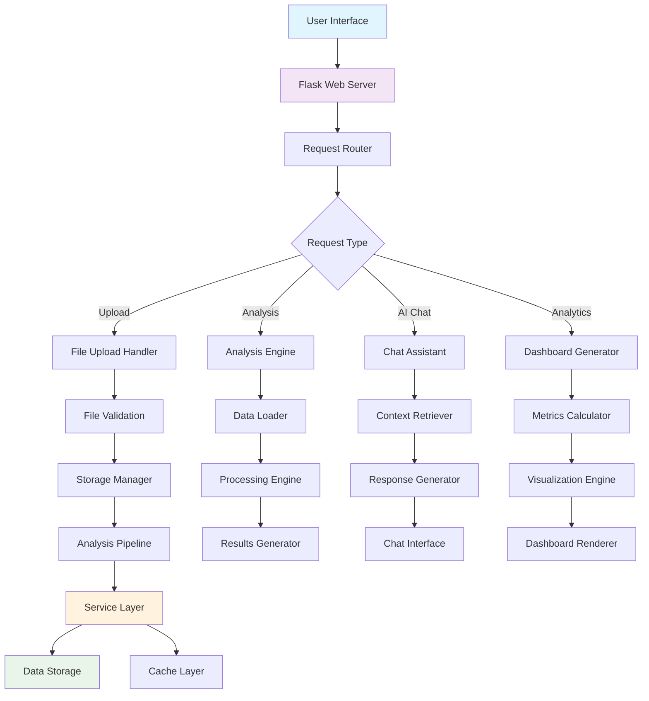

### Core Processing Workflow

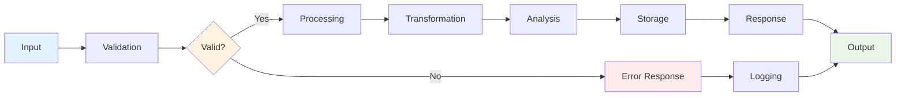

---

## File Upload & Processing Workflow

### File Upload Workflow Diagram

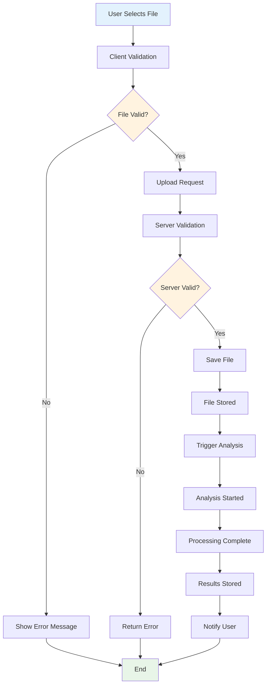

### Detailed File Processing Steps

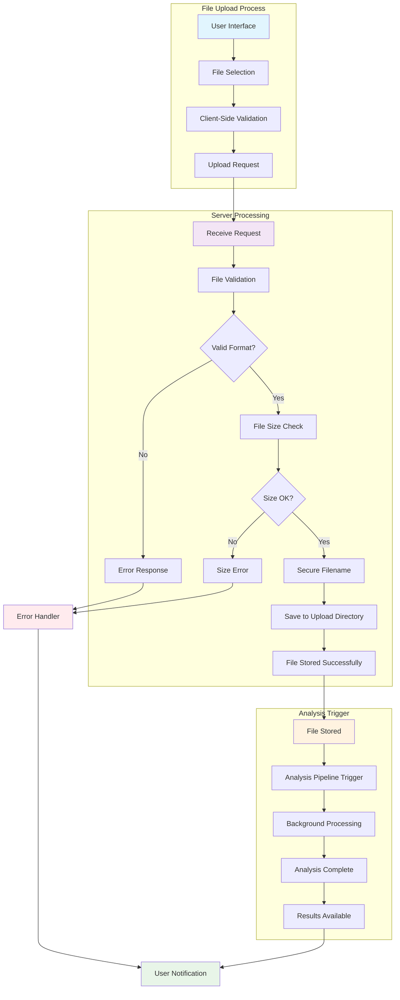

### File Validation Workflow

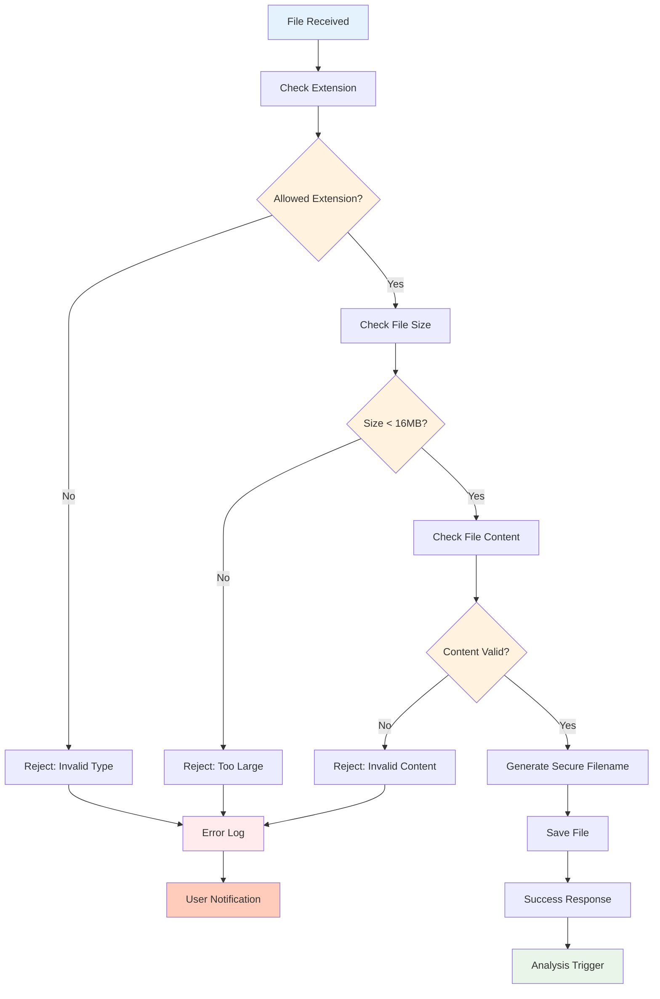

---

## Log Analysis Pipeline Workflow

### Complete Analysis Pipeline

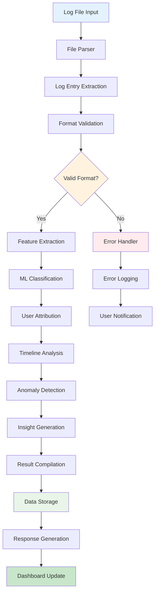

### Log Parsing Workflow

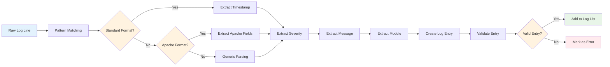

### Classification Workflow

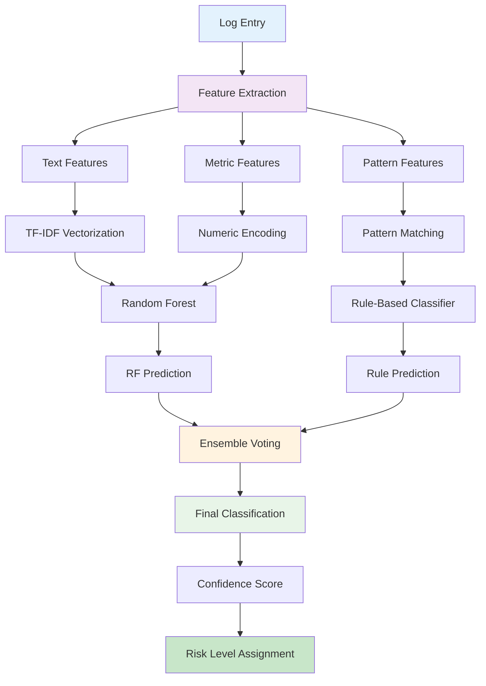

---

## User Attribution Workflow

### User Attribution Process

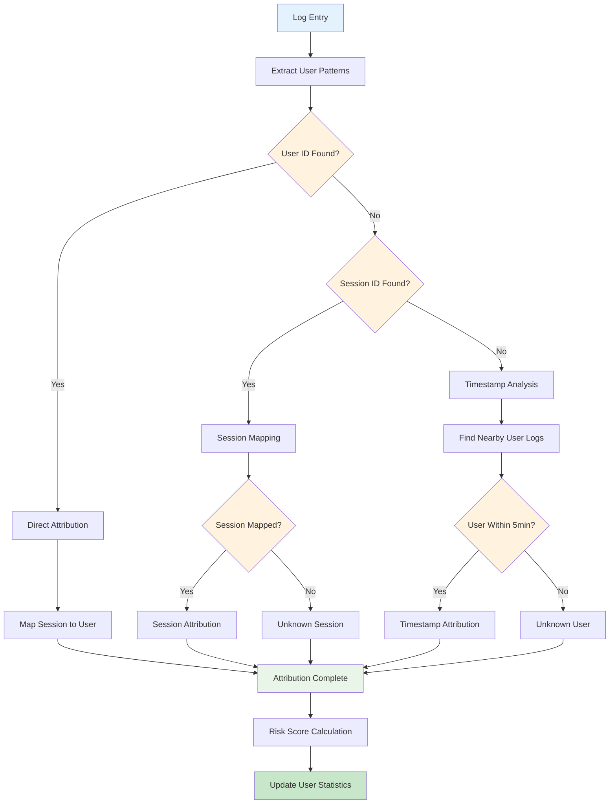

### User Pattern Extraction Workflow

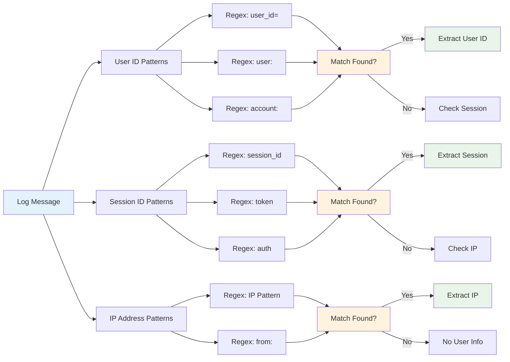

### Risk Scoring Workflow

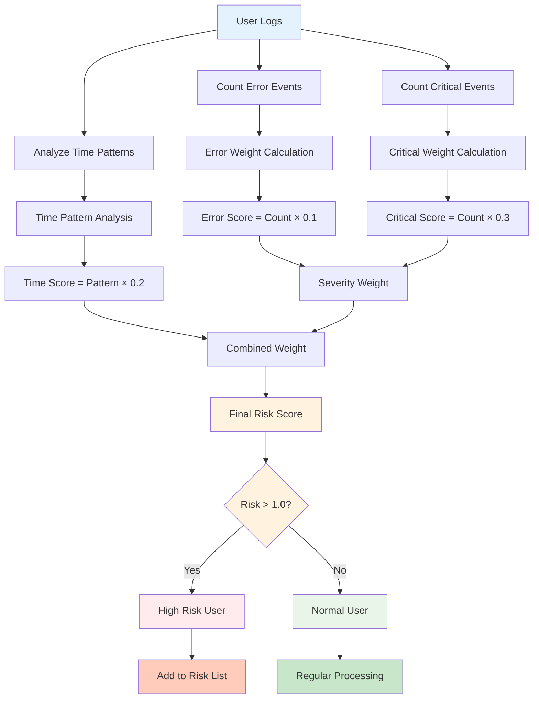

---

## AI Chat Assistant Workflow

### AI Chat Processing Workflow

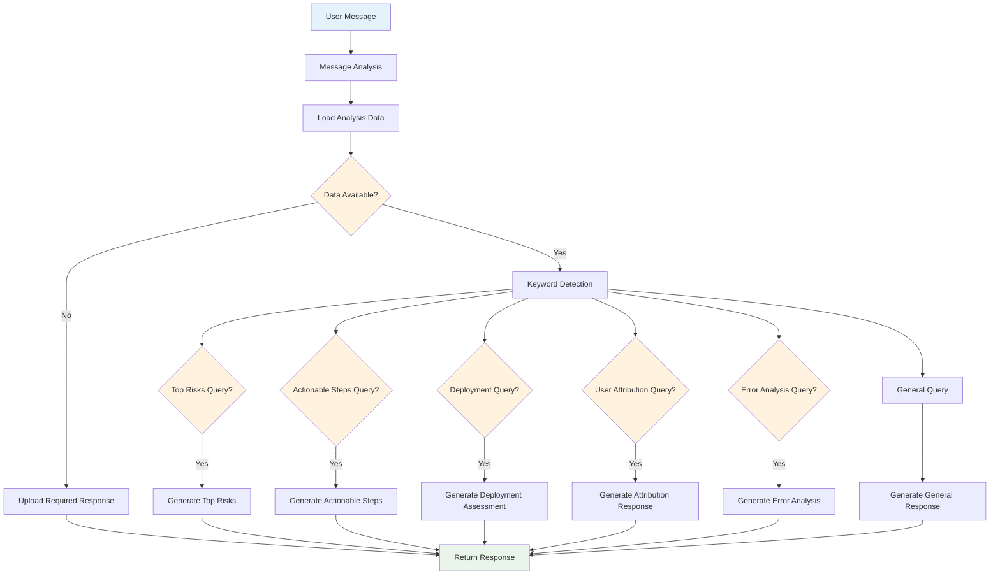

### Response Generation Workflow

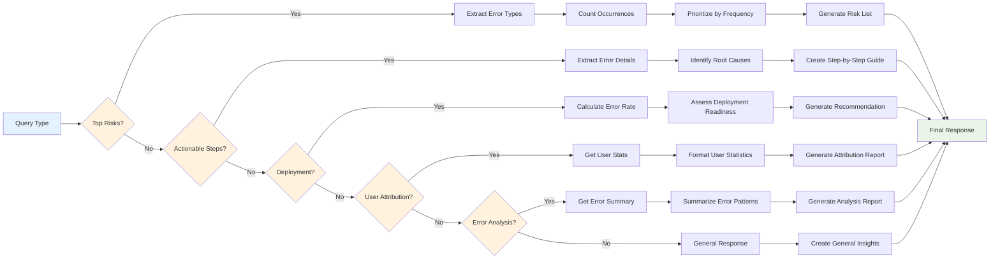

### Chat Interface Workflow

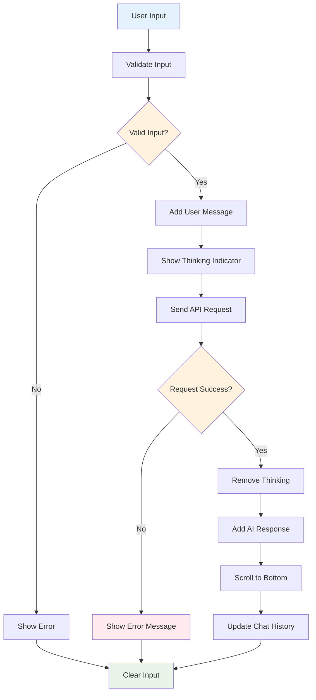

---

## Analytics Dashboard Workflow

### Dashboard Data Flow

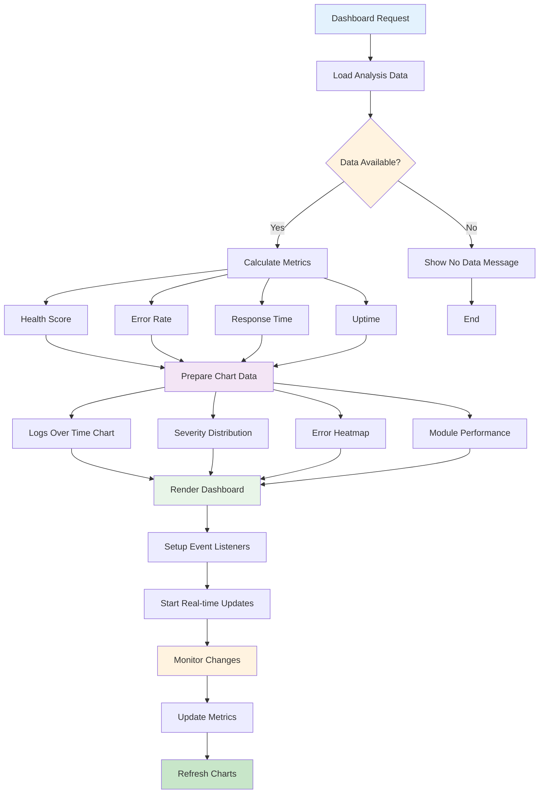

### Metrics Calculation Workflow

```mermaid
graph LR
    A[Log Data] --> B[Count Total Logs]
    A --> C[Count Error Logs]
    A --> D[Count Critical Logs]
    
    B --> E[Calculate Error Rate]
    C --> E
    E --> F[Error Rate = Errors/Total × 100]
    
    F --> G[Health Score = 100 - (Error Rate × 2)]
    G --> H[Cap at 0-100]
    
    A --> I[Extract Timestamps]
    I --> J[Calculate Response Times]
    J --> K[Average Response Time]
    
    A --> L[Identify Uptime Periods]
    L --> M[Calculate Uptime Percentage]
    
    H --> N[Metrics Ready]
    K --> N
    M --> N
    
    style A fill:#e3f2fd
    style E fill:#fff3e0
    style G fill:#fff3e0
    style N fill:#e8f5e8
```

### Chart Data Preparation Workflow

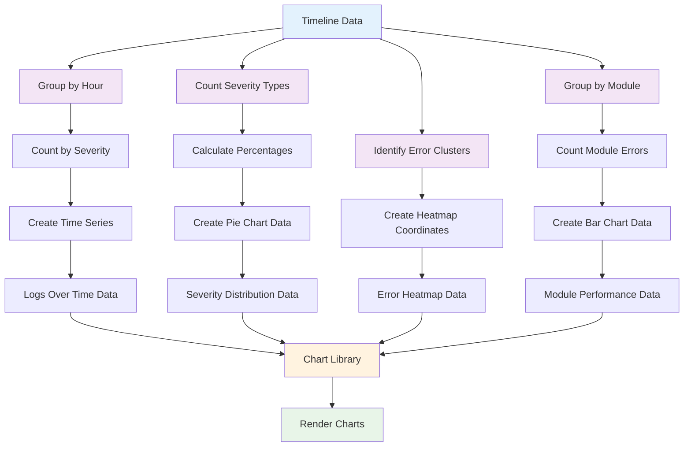

---

## Machine Learning Classification Workflow

### Hybrid Classification Process

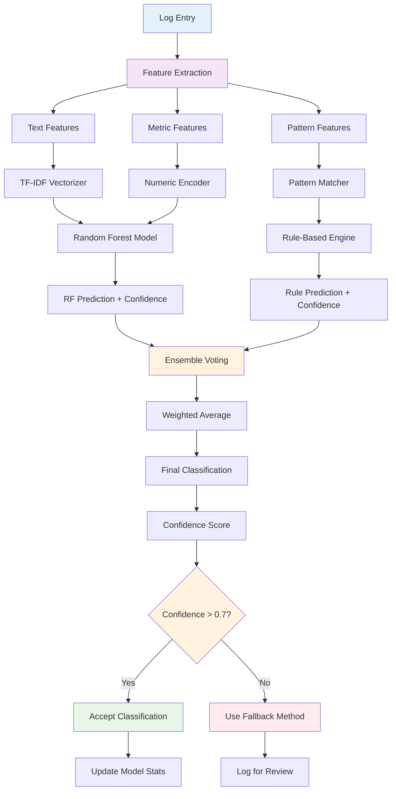

### Model Training Workflow

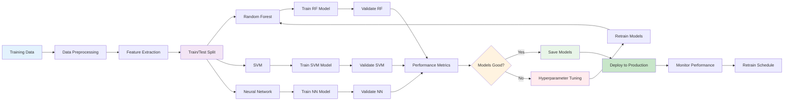

### Feature Engineering Workflow

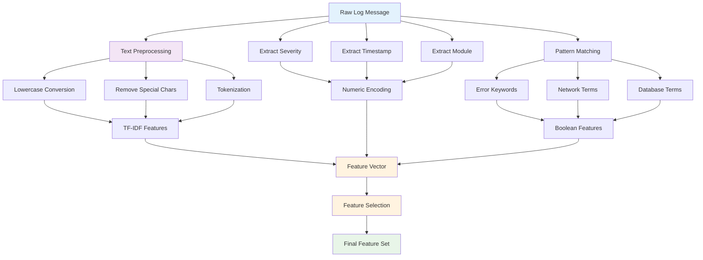

---

## Error Handling & Recovery Workflow

### Comprehensive Error Handling

```mermaid
graph TD
    A[Operation Start] --> B[Input Validation]
    B --> C{Input Valid?}
    C -->|No| D[ValidationError]
    C -->|Yes| E[Process Operation]
    
    E --> F{Operation Success?}
    F -->|No| G[Exception Caught]
    F -->|Yes| H[Return Result]
    
    G --> I{Error Type?}
    I -->|FileError| J[File Error Handler]
    I -->|NetworkError| K[Network Error Handler]
    I -->|MLError| L[ML Error Handler]
    I -->|ValidationError| M[Validation Error Handler]
    I -->|Other| N[General Error Handler]
    
    J --> O[Log Error]
    K --> O
    L --> O
    M --> O
    N --> O
    
    O --> P[Error Classification]
    P --> Q{Recoverable?}
    Q -->|Yes| R[Attempt Recovery]
    Q -->|No| S[Return Error Response]
    
    R --> T{Recovery Success?}
    T -->|Yes| U[Continue Operation]
    T -->|No| V[Fallback Procedure]
    
    U --> W[Log Recovery]
    V --> X[Use Default Values]
    
    W --> Y[Return Result]
    X --> Y
    
    D --> Z[User Notification]
    S --> Z
    Y --> AA[Operation Complete]
    Z --> AA
    
    style A fill:#e3f2fd
    style C fill:#fff3e0
    style F fill:#fff3e0
    style I fill:#fff3e0
    style Q fill:#fff3e0
    style T fill:#fff3e0
    style Z fill:#ffebee
    style AA fill:#e8f5e8
```

### Recovery Strategies Workflow

```mermaid
graph LR
    A[Error Detected] --> B{Critical Error?}
    B -->|Yes| C[Stop Operation]
    B -->|No| D[Continue Attempt]
    
    C --> E[Notify Admin]
    E --> F[Log Critical Error]
    F --> G[Emergency Shutdown]
    
    D --> H{Retry Count < 3?}
    H -->|Yes| I[Wait 1 Second]
    H -->|No| J[Use Fallback]
    
    I --> K[Retry Operation]
    K --> L{Success?}
    L -->|Yes| M[Log Recovery]
    L -->|No| N[Increment Retry Count]
    
    N --> H
    M --> O[Continue Processing]
    
    J --> P[Fallback Method]
    P --> Q{Fallback Available?}
    Q -->|Yes| R[Execute Fallback]
    Q -->|No| S[Skip Operation]
    
    R --> T[Log Fallback Used]
    T --> U[Continue with Limited Functionality]
    S --> V[Log Skipped Operation]
    
    style A fill:#ffebee
    style B fill:#fff3e0
    style H fill:#fff3e0
    style L fill:#fff3e0
    style Q fill:#fff3e0
    style G fill:#f44336
    style M fill:#4caf50
    style O fill:#4caf50
    style U fill:#ff9800
    style V fill:#ff9800
```

---

## Data Storage & Caching Workflow

### Storage Management Workflow

```mermaid
graph TD
    A[Data Request] --> B{Cache Hit?}
    B -->|Yes| C[Return Cached Data]
    B -->|No| D[Load from Storage]
    
    D --> E{File Exists?}
    E -->|No| F[Return Null]
    E -->|Yes| G[Read File]
    
    G --> H{Read Success?}
    H -->|No| I[Log Read Error]
    H -->|Yes| J[Parse Data]
    
    J --> K{Parse Success?}
    K -->|No| L[Log Parse Error]
    K -->|Yes| M[Validate Data]
    
    M --> N{Data Valid?}
    N -->|No| O[Log Validation Error]
    N -->|Yes| P[Cache Data]
    
    P --> Q[Set TTL]
    Q --> R[Return Data]
    
    C --> S[Check TTL]
    S --> T{Expired?}
    T -->|Yes| U[Remove Cache]
    T -->|No| V[Return Data]
    
    U --> D
    V --> W[End]
    R --> W
    F --> W
    I --> W
    L --> W
    O --> W
    
    style A fill:#e3f2fd
    style B fill:#fff3e0
    style E fill:#fff3e0
    style H fill:#fff3e0
    style K fill:#fff3e0
    style N fill:#fff3e0
    style T fill:#fff3e0
    style W fill:#e8f5e8
```

### Cache Management Workflow

```mermaid
graph LR
    A[Cache Request] --> B[Generate Cache Key]
    B --> C[Check Cache Store]
    C --> D{Item Found?}
    D -->|Yes| E[Check TTL]
    D -->|No| F[Cache Miss]
    
    E --> G{Expired?}
    G -->|Yes| H[Delete Item]
    G -->|No| I[Return Cached Item]
    
    H --> J[Cache Miss]
    F --> K[Load from Source]
    J --> K
    
    K --> L{Source Available?}
    L -->|No| M[Return Null]
    L -->|Yes| N[Get Data]
    
    N --> O[Store in Cache]
    O --> P[Set TTL]
    P --> Q[Return Data]
    
    I --> R[Update Access Time]
    R --> S[Return Data]
    
    M --> T[End]
    Q --> T
    S --> T
    
    style A fill:#e3f2fd
    style D fill:#fff3e0
    style G fill:#fff3e0
    style L fill:#fff3e0
    style T fill:#e8f5e8
```

---

## Security & Validation Workflow

### Security Validation Process

```mermaid
graph TD
    A[Input Received] --> B[Type Validation]
    B --> C{Valid Type?}
    C -->|No| D[Type Error]
    C -->|Yes| E[Format Validation]
    
    E --> F{Valid Format?}
    F -->|No| G[Format Error]
    F -->|Yes| H[Content Validation]
    
    H --> I{Safe Content?}
    I -->|No| J[Content Error]
    I -->|Yes| K[Size Validation]
    
    K --> L{Within Limits?}
    L -->|No| M[Size Error]
    L -->|Yes| N[Permission Check]
    
    N --> O{Authorized?}
    O -->|No| P[Auth Error]
    O -->|Yes| Q[Rate Limit Check]
    
    Q --> R{Within Limit?}
    R -->|No| S[Rate Limit Error]
    R -->|Yes| T[Process Request]
    
    D --> U[Log Security Event]
    G --> U
    J --> U
    M --> U
    P --> U
    S --> U
    
    T --> V[Return Success]
    U --> W[Return Error]
    
    style A fill:#e3f2fd
    style C fill:#fff3e0
    style F fill:#fff3e0
    style I fill:#fff3e0
    style L fill:#fff3e0
    style O fill:#fff3e0
    style R fill:#fff3e0
    style U fill:#ffebee
    style V fill:#4caf50
    style W fill:#f44336
```

### Input Sanitization Workflow

```mermaid
graph LR
    A[Raw Input] --> B[HTML Sanitization]
    B --> C[Remove Tags]
    C --> D[Remove Attributes]
    D --> E[Remove Scripts]
    
    E --> F[Character Sanitization]
    F --> G[Remove Special Chars]
    G --> H[Normalize Unicode]
    H --> I[Trim Whitespace]
    
    I --> J[Pattern Validation]
    J --> K[Check for Patterns]
    K --> L[Block Dangerous Patterns]
    
    L --> M[Length Validation]
    M --> N{Within Limits?}
    N -->|No| O[Truncate/Reject]
    N -->|Yes| P[Final Validation]
    
    O --> Q[Log Sanitization]
    P --> R[Sanitized Output]
    
    Q --> S[Security Alert]
    R --> T[Continue Processing]
    
    style A fill:#ffebee
    style B fill:#fff3e0
    style F fill:#fff3e0
    style J fill:#fff3e0
    style N fill:#fff3e0
    style Q fill:#f44336
    style R fill:#4caf50
    style T fill:#e8f5e8
```

---

## Performance Optimization Workflow

### Performance Monitoring Process

```mermaid
graph TD
    A[Operation Start] --> B[Record Start Time]
    B --> C[Execute Operation]
    C --> D[Record End Time]
    D --> E[Calculate Duration]
    
    E --> F{Duration > Threshold?}
    F -->|Yes| G[Log Slow Operation]
    F -->|No| H[Normal Processing]
    
    G --> I[Check Memory Usage]
    H --> I
    I --> J{Memory > Limit?}
    J -->|Yes| K[Trigger GC]
    J -->|No| L[Continue]
    
    K --> M[Optimize Memory]
    M --> L
    
    L --> N[Update Metrics]
    N --> O[Check Performance Trends]
    
    O --> P{Performance Degradation?}
    P -->|Yes| Q[Alert Admin]
    P -->|No| R[Normal Operation]
    
    Q --> S[Initiate Optimization]
    S --> T[Monitor Improvement]
    
    style A fill:#e3f2fd
    style F fill:#fff3e0
    style J fill:#fff3e0
    style P fill:#fff3e0
    style Q fill:#ffebee
    style R fill:#e8f5e8
    style S fill:#ff9800
```

### Optimization Strategies Workflow

```mermaid
graph LR
    A[Performance Issue] --> B{Bottleneck Type?}
    B -->|CPU| C[CPU Optimization]
    B -->|Memory| D[Memory Optimization]
    B -->|I/O| E[I/O Optimization]
    B -->|Network| F[Network Optimization]
    
    C --> G[Algorithm Optimization]
    C --> H[Parallel Processing]
    C --> I[Caching]
    
    D --> J[Memory Pooling]
    D --> K[Garbage Collection]
    D --> L[Data Structure Optimization]
    
    E --> M[Batch Processing]
    E --> N[Async I/O]
    E --> O[Compression]
    
    F --> P[Connection Pooling]
    F --> Q[Data Compression]
    F --> R[CDN Usage]
    
    G --> S[Test Improvement]
    H --> S
    I --> S
    J --> S
    K --> S
    L --> S
    M --> S
    N --> S
    O --> S
    P --> S
    Q --> S
    R --> S
    
    S --> T{Performance Improved?}
    T -->|Yes| U[Deploy Optimization]
    T -->|No| V[Try Different Strategy]
    
    V --> B
    U --> W[Monitor Results]
    
    style A fill:#ff9800
    style B fill:#fff3e0
    style T fill:#fff3e0
    style U fill:#4caf50
    style V fill:#ffebee
    style W fill:#e8f5e8
```

---

## Deployment & Maintenance Workflow

### Deployment Process Workflow

```mermaid
graph TD
    A[Deployment Start] --> B[Environment Check]
    B --> C{Environment Ready?}
    C -->|No| D[Setup Environment]
    C -->|Yes| E[Backup Current Version]
    
    D --> F[Install Dependencies]
    F --> G[Configure Services]
    G --> H[Environment Ready]
    H --> E
    
    E --> I[Stop Current Services]
    I --> J[Deploy New Code]
    J --> K[Run Database Migrations]
    K --> L[Start New Services]
    
    L --> M[Health Check]
    M --> N{Services Healthy?}
    N -->|No| O[Rollback Deployment]
    N -->|Yes| P[Run Smoke Tests]
    
    O --> Q[Restore Backup]
    Q --> R[Start Old Services]
    R --> S[Notify Failure]
    
    P --> T{Tests Pass?}
    T -->|No| U[Investigate Issues]
    T -->|Yes| V[Deployment Complete]
    
    U --> W[Fix Issues]
    W --> X[Redeploy]
    X --> M
    
    V --> Y[Monitor Performance]
    Y --> Z[Update Documentation]
    Z --> AA[Notify Success]
    
    style A fill:#e3f2fd
    style C fill:#fff3e0
    style N fill:#fff3e0
    style T fill:#fff3e0
    style S fill:#ffebee
    style AA fill:#4caf50
    style V fill:#4caf50
```

### Maintenance Workflow

```mermaid
graph LR
    A[Maintenance Trigger] --> B{Maintenance Type?}
    B -->|Scheduled| C[Planned Maintenance]
    B -->|Emergency| D[Emergency Maintenance]
    B -->|Update| E[Software Update]
    
    C --> F[Notify Users]
    D --> G[Immediate Action]
    E --> H[Prepare Update]
    
    F --> I[Schedule Downtime]
    G --> J[Assess Impact]
    H --> K[Test Update]
    
    I --> L[Backup System]
    J --> L
    K --> L
    
    L --> M[Perform Maintenance]
    M --> N[Verify Systems]
    N --> O{Systems OK?}
    O -->|No| P[Troubleshoot]
    O -->|Yes| Q[Restore Services]
    
    P --> R[Fix Issues]
    R --> N
    
    Q --> S[Monitor Performance]
    G --> S
    S --> T[Update Documentation]
    T --> U[Notify Completion]
    
    style A fill:#ff9800
    style B fill:#fff3e0
    style O fill:#fff3e0
    style P fill:#ffebee
    style U fill:#4caf50
```

---

## Workflow Decision Trees

### File Processing Decision Tree

```mermaid
graph TD
    A[File Received] --> B{Valid Extension?}
    B -->|No| C[Reject File]
    B -->|Yes| D{Size < 16MB?}
    D -->|No| E[Reject: Too Large]
    D -->|Yes| F{Content Valid?}
    F -->|No| G[Reject: Invalid Content]
    F -->|Yes| H{Parseable Format?}
    H -->|No| I[Generic Parser]
    H -->|Yes| J[Standard Parser]
    
    I --> K[Extract Basic Info]
    J --> L[Extract Detailed Info]
    
    K --> M[Create Log Entry]
    L --> M
    M --> N[Add to Processing Queue]
    
    C --> O[Log Error]
    E --> O
    G --> O
    O --> P[Notify User]
    
    N --> Q[Process Complete]
    P --> R[End]
    Q --> R
    
    style A fill:#e3f2fd
    style B fill:#fff3e0
    style D fill:#fff3e0
    style F fill:#fff3e0
    style H fill:#fff3e0
    style O fill:#ffebee
    style R fill:#e8f5e8
```

### Error Classification Decision Tree

```mermaid
graph LR
    A[Log Entry] --> B{Contains Error Keywords?}
    B -->|Yes| C{Database Terms?}
    B -->|No| D{Warning Keywords?}
    
    C -->|Yes| E[Database Error]
    C -->|No| F{Network Terms?}
    F -->|Yes| G[Network Error]
    F -->|No| H[General Error]
    
    D -->|Yes| I[Warning]
    D -->|No| J{Critical Keywords?}
    J -->|Yes| K[Critical]
    J -->|No| L[Info]
    
    E --> M[High Priority]
    G --> M
    H --> N[Medium Priority]
    I --> O[Low Priority]
    K --> P[Urgent Priority]
    L --> Q[Normal Priority]
    
    style A fill:#e3f2fd
    style B fill:#fff3e0
    style C fill:#fff3e0
    style D fill:#fff3e0
    style J fill:#fff3e0
    style M fill:#f44336
    style N fill:#ff9800
    style O fill:#ffeb3b
    style P fill:#d32f2f
    style Q fill:#4caf50
```

### User Attribution Decision Tree

```mermaid
graph TD
    A[Log Entry] --> B{User ID Present?}
    B -->|Yes| C[Direct Attribution]
    B -->|No| D{Session ID Present?}
    
    D -->|Yes| E{Session Mapped?}
    E -->|Yes| F[Session Attribution]
    E -->|No| G[Unknown Session]
    
    D -->|No| H{Timestamp Available?}
    H -->|Yes| I{Nearby User Within 5min?}
    I -->|Yes| J[Timestamp Attribution]
    I -->|No| K[Unknown User]
    
    H -->|No| K
    
    C --> L[Map Session]
    F --> M[Calculate Risk]
    G --> N[Low Confidence]
    J --> M
    K --> O[No Attribution]
    
    L --> P[Update Statistics]
    M --> P
    N --> P
    O --> P
    
    style A fill:#e3f2fd
    style B fill:#fff3e0
    style E fill:#fff3e0
    style H fill:#fff3e0
    style I fill:#fff3e0
    style P fill:#e8f5e8
```

---

## Workflow Metrics & KPIs

### Performance Metrics Workflow

```mermaid
graph LR
    A[Workflow Execution] --> B[Collect Metrics]
    B --> C[Processing Time]
    B --> D[Memory Usage]
    B --> E[Error Rate]
    B --> F[Throughput]
    
    C --> G[Response Time KPI]
    D --> H[Memory KPI]
    E --> I[Reliability KPI]
    F --> J[Efficiency KPI]
    
    G --> K{Response Time < 2s?}
    H --> L{Memory < 1GB?}
    I --> M{Error Rate < 1%?}
    J --> N{Throughput > 100/min?}
    
    K -->|No| O[Optimize Speed]
    L -->|No| P[Optimize Memory]
    M -->|No| Q[Improve Reliability]
    N -->|No| R[Increase Throughput]
    
    K -->|Yes| S[Speed OK]
    L -->|Yes| T[Memory OK]
    M -->|Yes| U[Reliability OK]
    N -->|Yes| V[Throughput OK]
    
    O --> W[Implement Changes]
    P --> W
    Q --> W
    R --> W
    
    W --> X[Retest Performance]
    X --> A
    
    S --> Y[Continue Monitoring]
    T --> Y
    U --> Y
    V --> Y
    
    style A fill:#e3f2fd
    style B fill:#f3e5f5
    style K fill:#fff3e0
    style L fill:#fff3e0
    style M fill:#fff3e0
    style N fill:#fff3e0
    style O fill:#ffebee
    style W fill:#ff9800
    style Y fill:#e8f5e8
```

---

## Conclusion

This comprehensive workflow documentation provides detailed procedural workflows for all major processes in the AI Log Auditing Platform. Each workflow includes:

### **Key Workflow Features**:
- **Visual Diagrams**: Mermaid diagrams for clear visualization
- **Decision Points**: Clear branching logic and conditions
- **Error Handling**: Comprehensive error management paths
- **Performance Considerations**: Optimization checkpoints
- **Security Measures**: Validation and security checkpoints
- **Recovery Strategies**: Fallback and recovery procedures

### **Workflow Categories**:
- **System Architecture**: High-level system flow
- **Data Processing**: End-to-end data workflows
- **User Interactions**: Complete user journey flows
- **Machine Learning**: ML pipeline workflows
- **Operations**: Deployment and maintenance processes
- **Security**: Validation and protection workflows

### **Implementation Benefits**:
- **Clear Process Understanding**: Visual representation of complex processes
- **Error Prevention**: Proactive error handling at decision points
- **Performance Optimization**: Built-in performance checkpoints
- **Team Collaboration**: Shared understanding of procedures
- **Training Resource**: Comprehensive onboarding documentation

The workflows are designed to be both comprehensive and practical, providing real guidance for system operation, maintenance, and optimization.

---

*Last Updated: April 17, 2026*
*Version: 1.0*
*Author: Development Team*
